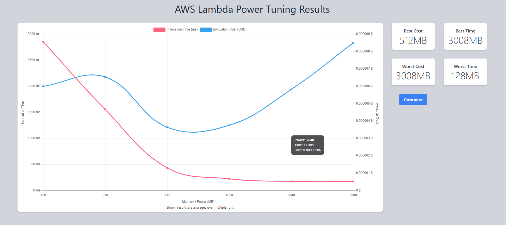
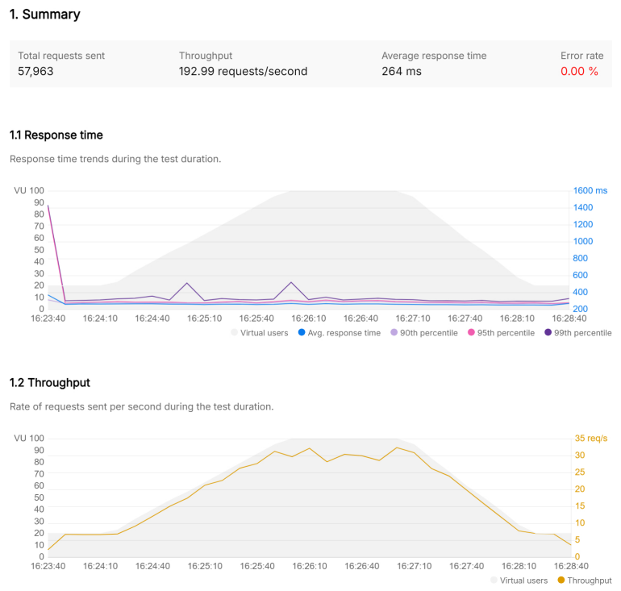
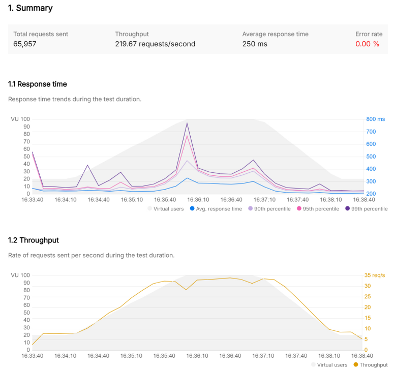

# ⚡ Serverless Showdown: AWS Lambda (Power Tuned) vs. ECS Fargate

> **A hands-on, end-to-end comparison of two dominant AWS compute paradigms, Lambda with Power Tuning vs. ECS Fargate, stress-tested with Postman and broken down by cost.**

[](https://aws.amazon.com)
[](https://aws.amazon.com/cloudformation/)
[](https://aws.amazon.com/lambda/)
[](https://aws.amazon.com/ecs/)
[](https://aws.amazon.com/dynamodb/)
[](https://www.postman.com/)

---
## 📁 Repository Structure

```
serverless-showdown/
├── README.md
├── LICENSE
├── .github/workflows              # Github actions if you want a workflow (which I love)
│   └── deploy.yaml    
├── cloudformation/
│   ├── lambda-stack.yaml          # DynamoDB + IAM + Lambda + HTTP API
│   └── ecs-stack.yaml             # ECR + VPC (public/private) + NAT + ALB + ECS Fargate
├── ecs/
│   ├── app.py                     # Flask CRUD API (same logic as Lambda)
│   ├── Dockerfile
│   └── requirements.txt
└── images/
    ├── power-tuning-results.png
    ├── postman-lambda-results.png
    └── postman-ecs-results.png
```

---

## 📖 Table of Contents

- [Why This Project?](#-why-this-project)
- [Architecture Overview](#-architecture-overview)
- [Prerequisites](#-prerequisites)
- [Part 1, Lambda Serverless API (CloudFormation)](#-part-1--lambda-serverless-api-cloudformation)
- [Part 2, Lambda Power Tuning](#-part-2--lambda-power-tuning)
- [Part 3, ECS Fargate API (CloudFormation)](#-part-3--ecs-fargate-api-cloudformation)
- [Part 4, Performance Testing with Postman](#-part-4--performance-testing-with-postman)
- [Part 5, Cost Comparison](#-part-5--cost-comparison)
- [Results & Verdict](#-results--verdict)
- [Limitations & Fair Comparison Notes](#️-limitations--fair-comparison-notes)
- [Cleanup](#-cleanup)
- [Key Takeaways](#-key-takeaways)

---

## 🎯 Why This Project?

Choosing betIen serverless and containers is one of the most common decisions cloud engineers face. Rather than relying on theory, this project builds **both architectures from scratch**, optimizes the Lambda side with **AWS Lambda Power Tuning**, hits them both with **identical Postman load tests**, and compares them on **latency, throughput, and cost**.

**Everything is provisioned via CloudFormation**, just deploy the stacks and you're ready to test. No clicking around the console. No manual resource wiring.

The goal: data-driven ansIrs instead of opinions.

---

## 🏗 Architecture Overview

I deploy **two parallel stacks** that serve the same DynamoDB-backed CRUD API:

### Path A, Lambda Serverless (Power Tuned)

```
Client → API Gateway (HTTP API) → Lambda (Python 3.13) → DynamoDB
                                  ↑
                        Power Tuning (Step Functions)
                        finds optimal memory config
```

### Path B, ECS Fargate

```
Client → Application Load Balancer → ECS Fargate (Flask container) → DynamoDB
```

Both paths expose the same CRUD operations, `create`, `read`, `update`, `delete`, `list`, against the same DynamoDB table, ensuring an apples-to-apples comparison.

### High-Level Diagram

```
┌─────────────────────────────────────────────────────────────────────┐
│                          CLIENTS / POSTMAN                          │
└──────────┬──────────────────────────────────────┬───────────────────┘
           │                                      │
           ▼                                      ▼
┌─────────────────────┐              ┌─────────────────────────┐
│   API Gateway HTTP  │              │  Application Load       │
│   (Managed)         │              │  Balancer (ALB)         │
└────────┬────────────┘              │  ┌─ Public Subnets ──┐  │
         │                           └──┘                   └──┘
         ▼                                    │
┌─────────────────────┐              ┌────────┴────────────────┐
│   AWS Lambda        │              │  ┌─ Private Subnets ─┐  │
│   Python 3.13       │              │  │ ECS Fargate Service│  │
│   (Power Tuned)     │              │  │ Flask Container    │  │
└────────┬────────────┘              │  │ (2 tasks, 0.5 vCPU)│ │
         │                           │  └──────┬─────────────┘ │
         │                           │    NAT Gateway → IGW    │
         │                           └─────────┬───────────────┘
         └──────────┬──────────────────────────┘
                    ▼
         ┌─────────────────────┐
         │     DynamoDB        │
         │  (lambda-apigateway)│
         └─────────────────────┘
```

---

## 📋 Prerequisites

- AWS CLI configured with appropriate permissions
- Docker installed (for building the ECS container image)
- [Postman](https://www.postman.com/downloads/) installed on your local computer
- An AWS account with access to CloudFormation, Lambda, ECS, ECR, DynamoDB, API Gateway, and IAM

---

## 🔶 Part 1, Lambda Serverless API (CloudFormation)

This single CloudFormation template provisions the **entire Lambda stack**: DynamoDB table, IAM role with least-privilege policy, Lambda function, API Gateway HTTP API with a `POST /DynamoDBManager` route, and an auto-deployed `$default` stage.

### 1.1 The Lambda Stack Template

In **`cloudformation/lambda-stack.yaml`**:

### 1.2 Deploy the Lambda Stack

```bash
aws cloudformation deploy \
  --template-file cloudformation/lambda-stack.yaml \
  --stack-name serverless-showdown-lambda \
  --capabilities CAPABILITY_NAMED_IAM
```

### 1.3 Get the Outputs

```bash
aws cloudformation describe-stacks \
  --stack-name serverless-showdown-lambda \
  --query 'Stacks[0].Outputs' \
  --output table
```

Save the `ApiEndpoint` and `LambdaFunctionArn`, you'll need both.

### 1.4 Validate End-to-End

Test with a quick echo call:

```bash
curl -X POST <YOUR_API_ENDPOINT> \
  -H 'Content-Type: application/json' \
  -d '{
    "operation": "echo",
    "payload": {
      "message": "Lambda is alive!",
      "timestamp": "2025-01-01T00:00:00Z"
    }
  }'
```

Then insert a real item:

```bash
curl -X POST <YOUR_API_ENDPOINT> \
  -H 'Content-Type: application/json' \
  -d '{
    "operation": "create",
    "tableName": "lambda-apigateway",
    "payload": {
      "Item": {
        "id": "test-001",
        "name": "Serverless Lab",
        "status": "active"
      }
    }
  }'
```

Verify in **DynamoDB Console → Explore table items**, the record should appear.

### 1.5 What CloudFormation Just Created

Take a moment to review what was deployed, understanding each resource is key:

| Resource | Type | Purpose |
|----------|------|---------|
| `DynamoDBTable` | `AWS::DynamoDB::Table` | On-demand CRUD table with `id` partition key |
| `LambdaExecutionRole` | `AWS::IAM::Role` | Least-privilege role scoped to this specific table |
| `LambdaFunction` | `AWS::Lambda::Function` | Python 3.13 CRUD handler with inline code |
| `HttpApi` | `AWS::ApiGatewayV2::Api` | HTTP API (faster and cheaper than REST API) |
| `HttpApiIntegration` | `AWS::ApiGatewayV2::Integration` | Lambda proxy integration with v2.0 payload |
| `HttpApiRoute` | `AWS::ApiGatewayV2::Route` | `POST /DynamoDBManager` route |
| `LambdaApiGatewayPermission` | `AWS::Lambda::Permission` | Allows API Gateway to invoke Lambda |
| `HttpApiStage` | `AWS::ApiGatewayV2::Stage` | `$default` stage with auto-deploy |

---

## ⚡ Part 2, Lambda Power Tuning

This is where things get interesting. AWS Lambda Power Tuning is an open-source Step Functions state machine that runs your function at **multiple memory configurations** and tells you the **optimal setting for cost, speed, or a balance of both**.

### Why Power Tuning Matters

Lambda allocates CPU proportionally to memory. The default 128MB might be starving your function of compute, or 1024MB might be overkill. Power Tuning eliminates the guesswork.

### 2.1 Deploy Power Tuning via SAR

The AWS Serverless Application Repository deploys Power Tuning as a CloudFormation stack, one click and everything is provisioned.

1. Open the [AWS Lambda Power Tuning SAR page](https://serverlessrepo.aws.amazon.com/applications/arn:aws:serverlessrepo:us-east-1:451282441545:applications~aws-lambda-power-tuning)
2. Click **Deploy**
3. Leave the defaults → **Deploy**

> 💡 **What's happening under the hood:** SAR applications are CloudFormation templates published by the community. When you click Deploy, it creates a stack named `serverlessrepo-aws-lambda-Power-tuning` containing all the Power Tuning infrastructure (Step Functions state machine, supporting Lambdas, IAM roles). Wait until the stack status shows `CREATE_COMPLETE` (~2 minutes).

### 2.2 Run Power Tuning

1. **Step Functions Console** → find `PowerTuningStateMachine`
2. **Start execution** with this input (replace the ARN with your Lambda ARN from Part 1 outputs):

```json
{
  "lambdaARN": "<YOUR_LAMBDA_FUNCTION_ARN>",
  "PowerValues": [128, 256, 512, 1024, 2048, 3008],
  "num": 50,
  "payload": {
    "operation": "create",
    "tableName": "lambda-apigateway",
    "payload": {
      "Item": {
        "id": "Power-tune-test",
        "name": "tuning"
      }
    }
  },
  "parallelInvocation": true,
  "strategy": "balanced"
}
```

3. Wait for completion (~2-5 minutes). The output includes a **visualization URL**.

### 2.3 Interpret Results

The Power Tuning visualization shows a graph plotting **memory size vs. execution time and cost**.

**Actual results (us-west-2):**



| Memory (MB) | Avg Duration (ms) | Avg Cost per Invocation |
|:---:|:---:|:---:|
| 128 | ~2,850 | ~$0.0000060 |
| 256 | ~2,200 | ~$0.0000070 |
| 512 | ~1,200 | ~$0.0000040 (best cost) |
| 1024 | ~1,250 | ~$0.0000044 (sIet spot) |
| 2048 | 172 | $0.0000058 |
| 3008 | ~150 | ~$0.0000090 (worst cost) |

> 📊 **Finding:** The best cost was **512MB** and the best time was **3008MB**. The massive drop happens betIen 256MB and 512MB, going from ~2,200ms to ~1,200ms. At **1024MB**, latency drops to ~250ms while cost stays nearly flat vs 512MB, that's the sIet spot. Beyond 1024MB, you pay significantly more per invocation for diminishing latency returns (172ms at 2048MB costs ~32% more).

### 2.4 Apply the Optimal Configuration

Update the Lambda memory via CLI:

```bash
aws lambda update-function-configuration \
  --function-name LambdaFunctionOverHttps \
  --memory-size 1024
```
---

## 🐳 Part 3, ECS Fargate API (CloudFormation)

Now I build the same API as a containerized Flask app on ECS Fargate. I'll first build and push the Docker image, then deploy the full infrastructure via CloudFormation.

### 3.1 the Flask Application

**`ecs/app.py`**

**`ecs/Dockerfile`**

**`ecs/requirements.txt`**


### 3.2 Deploy the ECS Stack (Step 1, Infrastructure)

I deploy in two steps: first to create all infrastructure including the ECR repository, then push the Docker image, then update the service.

```bash
aws cloudformation deploy \
  --template-file cloudformation/ecs-stack.yaml \
  --stack-name serverless-showdown-ecs \
  --capabilities CAPABILITY_NAMED_IAM
```

> 💡 **Custom VPC CIDR:** To use a different address range (must be /16 through /24), add a parameter override. Subnets are calculated automatically:
> ```bash
> aws cloudformation deploy \
>   --template-file cloudformation/ecs-stack.yaml \
>   --stack-name serverless-showdown-ecs \
>   --capabilities CAPABILITY_NAMED_IAM \
>   --parameter-overrides VpcCIDR=172.16.0.0/20
> ```

> ☕ This takes ~4-6 minutes as it provisions the VPC, NAT Gateways, ALB, ECR repo, and ECS cluster. The ECS service will start but tasks will fail until pushing an image, that's expected.

### 3.3 Build & Push to ECR

Grab the ECR repository URI from the stack outputs, then build and push:

```bash
# Get the ECR repo URI from CloudFormation outputs
ECR_URI=$(aws cloudformation describe-stacks \
  --stack-name serverless-showdown-ecs \
  --query 'Stacks[0].Outputs[?OutputKey==`ECRRepositoryUri`].OutputValue' \
  --output text)

# Authenticate Docker to ECR
aws ecr get-login-password --region <REGION> | \
  docker login --username AWS --password-stdin $ECR_URI

# Build and push
cd ecs/
docker build -t serverless-showdown-ecs .
docker tag serverless-showdown-ecs:latest $ECR_URI:latest
docker push $ECR_URI:latest
```

### 3.4 Update the ECS Service (Step 2, Deploy Image)

Force the ECS service to pull the newly pushed image:

```bash
# Force new deployment to pick up the image
aws ecs update-service \
  --cluster serverless-showdown \
  --service showdown-api-service \
  --force-new-deployment
```

Wait ~1-2 minutes for the tasks to reach a healthy state. You can monitor progress in the ECS Console or with:

```bash
aws ecs wait services-stable \
  --cluster serverless-showdown \
  --services showdown-api-service
```

### 3.5 Get the Outputs

the following **`cloudformation/ecs-stack.yaml`** will provision the entire ECS infrastructure: ECR repository, VPC with public and private subnets, NAT Gateways, ALB, security groups, ECS cluster, task definition, service, and IAM roles. The ALB sits in public subnets while ECS tasks run in private subnets with no direct internet exposure.


### 3.6 Validate ECS API

```bash
curl -X POST http://<ALB_DNS_NAME>/DynamoDBManager \
  -H 'Content-Type: application/json' \
  -d '{
    "operation": "create",
    "tableName": "lambda-apigateway",
    "payload": {
      "Item": {
        "id": "ecs-001",
        "name": "ECS Fargate Lab",
        "status": "active"
      }
    }
  }'
```

### 3.7 What CloudFormation Just Created

| Resource | Type | Purpose |
|----------|------|---------|
| `ECRRepository` | `AWS::ECR::Repository` | Container image registry with lifecycle policy (keeps last 5 images) |
| `VPC` + 4 Subnets + IGW | Networking | Isolated VPC with 2 public + 2 private subnets across AZs via `Fn::Cidr` |
| `NatGatewayA/B` + EIPs | `AWS::EC2::NatGateway` | One NAT Gateway per AZ, allows private subnets to reach the internet |
| Public + Private Route Tables | `AWS::EC2::RouteTable` | Public routes via IGW; private routes via NAT Gateways |
| `DynamoDBEndpoint` | `AWS::EC2::VPCEndpoint` | Gateway endpoint, DynamoDB traffic stays on AWS network, free of charge |
| `ALBSecurityGroup` | `AWS::EC2::SecurityGroup` | Allows inbound HTTP (port 80) to ALB |
| `ECSSecurityGroup` | `AWS::EC2::SecurityGroup` | Only allows ALB → ECS on port 8080 (no direct internet access) |
| `ApplicationLoadBalancer` | `AWS::ElasticLoadBalancingV2` | Internet-facing ALB in **public subnets** |
| `ALBTargetGroup` + `Listener` | ALB config | Routes to ECS tasks in private subnets, health checks `/health` |
| `ECSTaskExecutionRole` | `AWS::IAM::Role` | Allows ECS to pull images from ECR and write logs |
| `ECSTaskRole` | `AWS::IAM::Role` | Allows containers to access DynamoDB (least-privilege) |
| `ECSCluster` | `AWS::ECS::Cluster` | Fargate cluster |
| `TaskDefinition` | `AWS::ECS::TaskDefinition` | 0.5 vCPU, 1 GB memory, Gunicorn container |
| `ECSService` | `AWS::ECS::Service` | Runs 2 Fargate tasks in **private subnets** behind the ALB |

---

## 🧪 Part 4, Performance Testing with Postman

Now the fun part: head-to-head performance testing.

### 4.1 Create the Postman Collection

Create a new collection called **Serverless Showdown** with two requests:

| Request Name | Method | URL |
|---|---|---|
| Lambda - Create Item | POST | `https://<API_GW_URL>/DynamoDBManager` |
| ECS - Create Item | POST | `http://<ALB_DNS>/DynamoDBManager` |

Both use the same body:

```json
{
  "operation": "create",
  "tableName": "lambda-apigateway",
  "payload": {
    "Item": {
      "id": "{{$randomUUID}}",
      "name": "{{$randomFullName}}",
      "email": "{{$randomEmail}}",
      "timestamp": "{{$isoTimestamp}}"
    }
  }
}
```

### 4.2 Run Performance Test with Postman

I used Postman's **Performance Testing** feature (not just Collection Runner) to simulate realistic concurrent load:

1. Open your collection → **Run** → **Performance**
2. Configure:
   - **Virtual users:** 100 VU
   - **Duration:** 5 minutes
   - **Load profile:** Peak
3. Run Lambda collection first, then ECS collection
4. Export the PDF reports

### 4.3 Performance Results

Here's what I measured with **100 virtual users over 5 minutes** using Peak load profile in **us-west-2**:





| Metric | Lambda (1024MB, Power Tuned) | ECS Fargate (0.5 vCPU, 2 tasks) |
|:---|:---:|:---:|
| **Total Requests** | 57,963 | 65,957 |
| **Throughput** | 192.99 req/s | 219.67 req/s |
| **Avg Response Time** | 264ms | 250ms |
| **Min Response Time** | 226ms | 194ms |
| **P90** | 285ms | 333ms |
| **P95** | 295ms | 362ms |
| **P99** | 324ms | 429ms |
| **Max Response Time** | 3,701ms | 1,138ms |
| **Error Rate** | 0% | 0% |

> 🔍 **Key Observations:**
> - **ECS wins on throughput**, 14% more total requests handled (65,957 vs 57,963) thanks to being always-warm with no cold start overhead.
> - **Lambda wins on tail latency**, surprisingly, Lambda's P90/P95/P99 Ire *tighter* than ECS (295ms vs 362ms at P95). Lambda's execution was more consistent once warm.
> - **Lambda's max spike tells the cold start story**, the 3,701ms max vs ECS's 1,138ms max shows the cold start penalty during the ramp-up phase when new Lambda instances spin up.
> - **Average latency was nearly identical**, 264ms (Lambda) vs 250ms (ECS). At steady state, the compute difference is marginal; DynamoDB call latency dominates.

### 4.4 Cold Start Deep Dive

Lambda cold starts shoId up clearly in the max response time, **3,701ms** vs ECS's 1,138ms. This happens during the ramp-up phase of the Peak load profile when Postman scales from 0 to 100 VU and Lambda spins up new execution environments.

| Cold Start Evidence | Lambda | ECS |
|---|:---:|:---:|
| Max response time | 3,701ms | 1,138ms |
| Avg response time | 264ms | 250ms |
| **Delta (max - avg)** | **3,437ms** | **888ms** |

The ~3.4 second gap between Lambda's max and average tells us cold starts added roughly **3+ seconds** of overhead on the worst invocations. Once warm, Lambda's P90 (285ms) was actually *better* than ECS's P90 (333ms).

With **Provisioned Concurrency** (not used here), cold starts drop to near zero, but costs rise closer to ECS.

---

## 💰 Part 5, Cost Comparison

This is where the decision gets real. I compare costs at **three traffic levels**.

### Assumptions

- Lambda: 1024MB memory (power tuned), avg 264ms execution
- ECS: 0.5 vCPU, 1GB memory, 2 tasks running 24/7
- Region: us-west-2
- DynamoDB costs excluded (identical for both)

### Cost Breakdown

| Traffic Scenario | Monthly Requests | Lambda Cost | ECS Fargate Cost (incl. NAT) | Winner |
|:---|:---:|:---:|:---:|:---:|
| **Low** (hobby/dev) | 100K | **~$0.47** | ~$95.27 | 🏆 Lambda |
| **Medium** (startup) | 5M | **~$23.50** | ~$95.27 | 🏆 Lambda |
| **High** (production) | 50M | ~$235.00 | **~$95.27** | 🏆 ECS |
| **Very High** (scale) | 500M | ~$2,350 | **~$124.84** (4 tasks) | 🏆 ECS |

### How I Calculated

**Lambda pricing (us-west-2):**
- $0.20 per 1M requests
- $0.0000166667 per GB-second
- Per-request cost: `$0.0000002 + (1.024 GB × 0.264s × $0.0000166667) = ~$0.0000047`
- Formula: `requests × $0.0000047`
- Free tier: 1M requests + 400,000 GB-seconds/month

**ECS Fargate pricing (us-west-2):**
- vCPU: $0.04048 per hour
- Memory: $0.004445 per GB per hour
- Formula per task: `(0.5 × $0.04048 × 730) + (1 × $0.004445 × 730) = $14.78/month`
- 2 tasks = $29.57/month (flat, regardless of traffic)
- **NAT Gateways:** 2 × $0.045/hr × 730 hrs = ~$65.70/month + $0.045/GB data processed

> ⚠️ **NAT Gateway costs are significant.** In this architecture, 2 NAT Gateways add ~$65.70/month to the ECS baseline. DynamoDB traffic is already routed through a free Gateway VPC Endpoint (no NAT charges for DB calls). To further reduce costs, you could add a VPC endpoint for ECR to eliminate NAT traffic for image pulls, or use a single NAT Gateway (reduced HA). The cost tables below include NAT Gateway costs for accuracy.

### Cost Crossover Visualization

```
Monthly Cost ($)
     │
 300 │                                              ╱ Lambda (1024MB)
     │                                           ╱
 200 │                                        ╱
     │                                     ╱
 125 │─ ─ ─ ─ ─ ─ ─ ─ ─ ─ ─ ─ ─ ─╳─ ─ ─ ─ ─ ─ ─ ECS (4 tasks + NAT)
 100 │─ ─ ─ ─ ─ ─ ─ ─ ─ ─ ─╳─ ─ ─ ─ ─ ─ ─ ─ ─ ─ ECS (2 tasks + NAT)
     │                    ╱
  50 │                 ╱
     │  ╱ Lambda    ╱
   0 │╱───────────────────────────────────────────
     └──────────────────────────────────────────── Requests/month
      100K    1M     10M     20M    50M    500M
                          ↑
                    Crossover point
                    (~20M requests)
```

> 💡 **The crossover:** With 1024MB Lambda and NAT Gateway costs factored in, ECS becomes cheaper at ~20M requests/month. If you chose 512MB (best cost from Power Tuning), the crossover moves to ~50M+ requests, but your latency would be ~5× higher. The memory config you choose fundamentally shifts the cost equation.

---

## 🏆 Results & Verdict

| Dimension | Lambda + Power Tuning | ECS Fargate | When to Choose |
|:---|:---:|:---:|:---|
| **Avg Latency** | 264ms | 250ms | Nearly identical at steady state |
| **P95 Latency** | 295ms | 362ms | Lambda tighter once warm |
| **Max Latency (cold start)** | 3,701ms | 1,138ms | ECS if cold starts are unacceptable |
| **Throughput** | 193 req/s | 220 req/s | ECS for sustained throughput |
| **Cost (< 20M req/mo)** | 🏆 Much cheaper | Fixed ~$95/mo (with NAT) | Lambda for variable/low traffic |
| **Cost (> 20M req/mo)** | Gets expensive | 🏆 Flat compute + NAT | ECS for high, steady throughput |
| **Ops Overhead** | Minimal | Moderate | Lambda for small teams |
| **Scaling Speed** | Instant | 1-2 minutes | Lambda for spiky workloads |
| **Max Execution Time** | 15 minutes | Unlimited | ECS for long-running tasks |
| **Power Tuning ROI** | 11× faster at 1024MB | N/A | Always power tune your Lambdas |

### TL;DR Decision Framework

```
Is your traffic spiky or unpredictable?
  → YES → Lambda (you only pay when it runs)
  → NO ↓

Do you need sub-50ms P99 latency?
  → YES → ECS Fargate (always warm)
  → NO ↓

Are you under 20M requests/month?
  → YES → Lambda (drastically cheaper)
  → NO → ECS Fargate (flat compute pricing wins at scale)
```

---

## ⚠️ Limitations & Fair Comparison Notes

No benchmark is perfect. Here's where this comparison has blind spots, and what you'd want to test before making a real production decision.

### This Workload Naturally Favors Lambda

A lightweight, short-lived CRUD API with low-to-moderate traffic is Lambda's sweet spot. ECS Fargate is paying for idle compute 24/7 to handle occasional POST requests, that's not what always-on containers are designed to shine at. A fairer test would also include scenarios where ECS has an edge: sustained high-concurrency bursts (1000+ concurrent requests), long-running operations (batch processing, data pipelines), or workloads needing persistent connections like WebSockets.

### The Load Test Is Decent But Not Exhaustive

I ran 100 virtual users over 5 minutes with a Peak load profile, a solid concurrent load test. But a production-grade benchmark would go further: longer duration (15-30 minutes) to capture steady-state behavior, multiple test runs for statistical significance, and varying payload sizes. Tools like **Artillery**, **k6**, or **Locust** could also provide more granular control over ramp-up patterns.

### Cold Starts Are Overstated for Production Lambda

Comparing raw Lambda cold starts against always-warm ECS containers overstates the real-world gap. In production, Lambda functions with steady traffic rarely cold-start. And if cold starts are truly a concern, **Provisioned Concurrency** eliminates them, though it pushes Lambda's cost model closer to ECS's always-on pricing.

### ECS Didn't Get Its Own "Tuning" Step

Lambda got Power Tuning to find its optimal memory/CPU balance (and I chose 1024MB as the sweet spot), but ECS was left at a fixed 0.5 vCPU / 1 GB with 2 Gunicorn workers. A fair comparison would experiment with ECS task sizing (CPU, memory), worker count, and task count to find ECS's own sweet spot. The container side has just as much room for optimization.

### What This Comparison Doesn't Cover

| Missing Dimension | Why It Matters |
|---|---|
| **Concurrent load testing** | Sequential requests hide scaling differences |
| **Provisioned Concurrency** | Levels the cold start playing field for Lambda |
| **ECS Auto Scaling** | ECS with target-tracking scaling behaves very differently than a fixed task count |
| **X-Ray / distributed tracing** | Would show exactly where latency lives (network, compute, DynamoDB) |
| **Larger payloads** | DynamoDB scans with 1000+ items would shift the CPU-bound vs. I/O-bound balance |
| **Multi-region** | Networking overhead changes the latency story significantly |

### Bottom Line

This project is a solid starting point for understanding the trade-offs. But if you're making a real architecture decision, run the test with **your actual workload shape**, traffic pattern, payload size, concurrency level, and latency SLA all shift the angle.

---

## 🧹 Cleanup

The beauty of CloudFormation, tear down everything with three commands. No hunting for orphaned resources.

### Go to CloudFormation and Delete All Stacks

> ✅ **That's it.** Empty the ECR repo, then delete three stacks. No leftover IAM roles, no orphaned security groups, no forgotten DynamoDB tables.

---

## 🎓 Key Takeaways

1. **Always Tune**, I went from ~2,850ms at 128MB to ~250ms at 1024MB, an **11× latency improvement** while cost barely moved. At 1024MB you get the best balance of speed and cost, beyond that, you're paying significantly more for diminishing returns.

2. **Lambda isn't always cheaper**, At 1024MB memory, Lambda's per-request cost is ~$0.0000047. ECS with NAT breaks even around 20M requests/month. If you use 512MB (best cost from Powerr Tuning), the crossover shifts to ~50M+ requests.

3. **Cold starts are real but narrow**, Our max Lambda response was 3,701ms vs an average of 264ms. That ~3.4 second penalty only hits during ramp-up, once warm, Lambda's P90 (285ms) actually beat ECS's P90 (333ms).

4. **ECS wins on throughput, Lambda wins on tail latency**, ECS handled 14% more requests (219.67 vs 192.99 req/s), but Lambda's P95 was tighter (295ms vs 362ms). The right choice depends on what you optimize for.

5. **Right tool, right job**, The best architecture depends on your traffic pattern, latency requirements, team size, and budget.

---

## 📚 References

- [AWS Lambda Documentation](https://docs.aws.amazon.com/lambda/)
- [AWS Lambda Power Tuning](https://github.com/alexcasalboni/aws-lambda-power-tuning)
- [Amazon ECS on Fargate](https://docs.aws.amazon.com/AmazonECS/latest/developerguide/AWS_Fargate.html)
- [AWS CloudFormation User Guide](https://docs.aws.amazon.com/AWSCloudFormation/latest/UserGuide/)
- [Postman Collection Runner](https://learning.postman.com/docs/collections/running-collections/intro-to-collection-runs/)
- [AWS Pricing Calculator](https://calculator.aws/)

---

## 📝 License

This project is licensed under the MIT License, see the [LICENSE](LICENSE) file for details.
